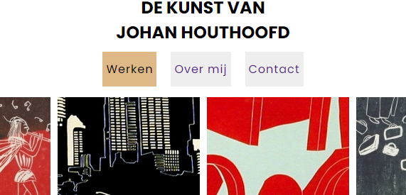

# Personal website for artist Johan Houthoofd

Welcome to my first responsive website repository.

I present you all [Johan Houthoofd](https://johanhouthoofd.com "Deployed website").

Johan is an artist who lives in Ghent, Belgium. He does art for a living.
He paints in the style of [linocut](https://en.wikipedia.org/wiki/Linocut "Linocut wikipedia entry").

In his minimalistic website you wil find a bunch of artworks which you may have the opportunity to showcase
through your visit.

Later on, you will be able to read a little about Johan (in four languages. Belgian people are that intelligent!), and his
art and society vision.

If you want to contact him, I made sure to include a card so you can give him a call or write an email.

# Words about the project

This is a simple html/css (with a little Javascript) project. It's intention is to show my skills to rapidly build a website from scratch.
I implemented the library lightbox2 via de node package manager (author [Lokesh Dhakar](https://lokeshdhakar.com/projects/lightbox2/ "LIGHTBOX")).

If you want to use it, you need to install its package release via npm:

`npm install lightbox2 --save`

# For in the future

* Add press articles and magazine entries.
* Move the website to a newer technology (Angular or React, probably Gatsby) in order to add a webshop.
* Consider a wordpress / CMS alternative to implement a blog.
